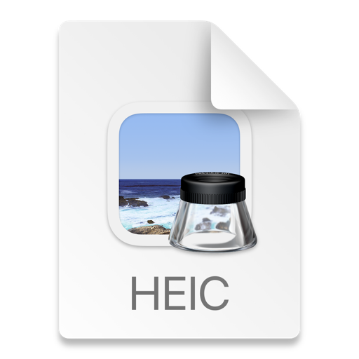

# Design Document

## _NineAM_ Design

## 1. Problem Statement

After graduating from NSS, how will the alumni get there 9am fix of answering a question thats been provided for them?

## 2. Top Questions to Resolve in Review

1. How can it be exclusive to NSS grads?
2. How far do I take profile customization?
3. How quickly should they be given the correct answer? Should they be able to change there answer during the five-minute window?

## 3. Use Cases
**BASIC FUNCTIONALITY**

**Profile**
U1. As a user, I want to see my history of trivia questions I got correct and incorrect

U2. As a user, I want a streak number next to my profile name, displaying how many days in a row I have been correct

U3. As a user, my trivia history is going to restart at the beginning of every month
**Leaderboard**
U3. As a user, I dont want to have to worry about adding every student I went to school with. Rather I would prefer to just see a leaderboard with familiar names, rankings and scores attached to their name.

U4. As a user, I want to be able to click on someone's name from the leaderboard, and see their trivia history for the month.

**Trivia**
U9. Every day at 9am, an identical trivia question with multiple choice answers will be presented to all users. They have until 9:05 to submit an answer. At 9:06, they can refresh their page to see if they got it correct or not. The leaderboard, their streak, and the data on their profile should all update.

U10. As a user, I would like relevant and challenging questions


**STRETCH**

*TwitterBot(X)*
Instead of refreshing your page at 9:06 to see the answer and updated data, you are instead given a link to a twitter account run by a bot that posts the correct answer for that day. Your data and the leaderboard is updated at 12pm instead. Now users are incentivized to check my website multiple times throughout the day, and have a Twitter account to engage with there fellow alumni on.

# 5. Proposed Architecture Overview

I will use an API gateway to create the endpoints: GetRankings, AddToRankings, ClearRankings, GetQuestion, PostQuestion, GetStreak, AddStreakToUser. These endpoints and probably more if needed, will handle the updating and retrieval of data for our players.

Quiz questions and answers will be stored in DynamoDB, along with leaderboards. User data and past participation will also be stored in DynamoDB, with a set expiration date to clear at the start of every month.

We will provide a web interface for users to answer the daily question, view the result

Avatar upload from local files.

## 6.1. Public Models
```

//Login 
String userId
String password

// HomeQuestion
String Question; //get question
Integer Answer; //submit integer
List<String> Questions;
List<String> Answers;

```

```
// ScoreBoard

List<String> userId
Integer streak

```
```
// Profile

String userId;
Integer contactId;
String dateTime;
List<String> notes;
```

## 6.2. Endpoints
* Accepts `GET /questions/daily' The backend would need to return the question text, a list of possible answers and the correct answer.
    * If the given question is not found, will throw a
      `QuestionNotFoundException`
* DELETE /users/:userId : rename yourself
*  DELETE /answers/:amswer : delete your answer if user is in the 5 minute window
* POST /submit/userId/:answers : records selected answer
* GET /leaderboard : takes you to the leaderboard page
* GET /questions/timer/start : Starts the 5 minute timer for the daily trivia question.
* GET /questions/timer/check : Checks if the 5 minute timer for the daily trivia question has expired.
* GET /questions/timer/remaining : Returns the remaining time on the 5 minute timer for the daily trivia question.
* DELETE /questions/timer


# 7. Tables

_Define the DynamoDB tables you will need for the data your service will use. It may be helpful to first think of what objects your service will need, then translate that to a table structure._
Users: Stores user data, such as name, userID, and maybe email?
Questions: Stores trivia questions, including the question text, answer choices, and correct answer.
Answers: Stores user answers to questions.
Scores: Stores user scores for each day.
Leaderboard: Stores the global leaderboard data, including rank, user ID, name, score, and streak.

### 7.1. ``
```
Questions - 


Partition key: questionId
Sort key: difficulty
Attributes:
question
answer
answerChoices
tags

Score -

Partition key: userId
Sort key: date
Attributes:
score

Leaderboards -

Partition key: rank
Sort key: userId
Attributes:
name
score
streak

UserAnswers - 
Partition key: userId
Sort key: questionId
Attributes:
answer

Profiles- 

Partition key: userId
Sort key: attributeName
Attributes:
name
email


```


# 8. Pages


\